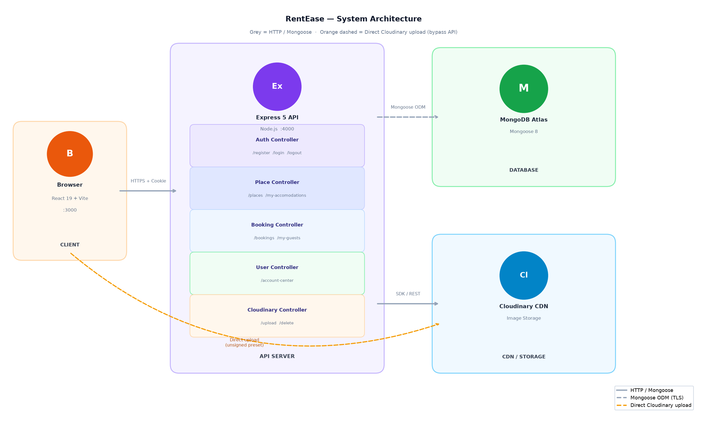
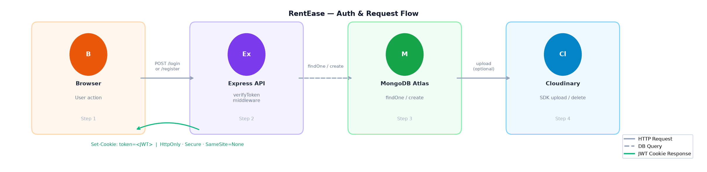
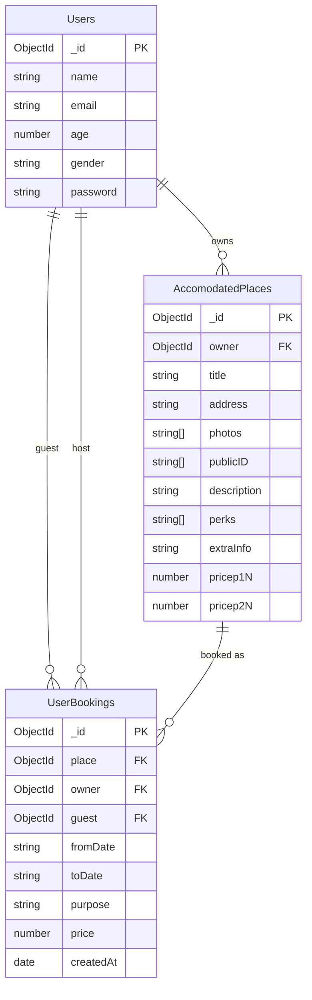
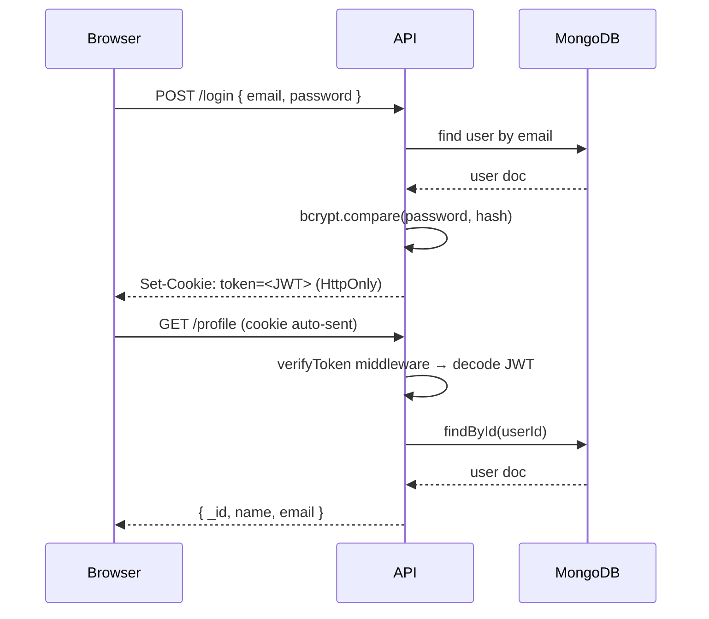
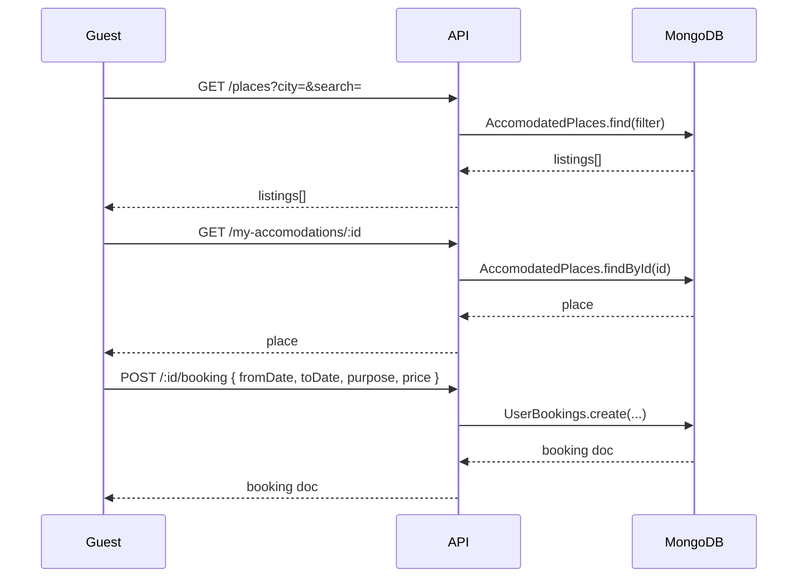
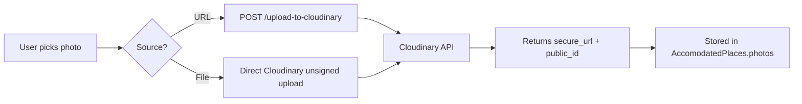

# RentEase

A full-stack property rental platform where users can list accommodations, browse listings by city, and manage bookings — built with React, Node/Express, MongoDB, and Cloudinary.

---

## Architecture Overview



**Arrow legend:** Grey = HTTP / Mongoose · Orange dashed = Direct Cloudinary upload (bypass API)

### Auth & Request Flow



---

## Features

- **Browse & Search** — Filter listings by city (Mumbai, Hyderabad, Bangalore, Delhi, Goa, Ahmedabad, Kolkata) with a live search bar
- **Auth** — JWT cookie-based register/login/logout; passwords hashed with bcryptjs
- **Listings** — Create, edit, and delete property listings with multi-photo upload (by URL or direct file), perks checkboxes, and tiered pricing
- **Photo Management** — Upload photos via URL (proxied to Cloudinary) or direct upload using an unsigned preset; reorder, set primary, delete with undo
- **Bookings** — Date range picker; auto-calculated price using a 2-night/1-night pricing model; booking history for guests and hosts
- **Account Center** — Update personal info (name, email, age, gender) and change password
- **Exclusive Price Badge** — Animated pulse badge for properties priced below threshold

---

## Tech Stack

| Layer | Technology |
|---|---|
| Frontend | React 19, React Router DOM v7, Axios |
| Build | Vite 6, Tailwind CSS 3, PostCSS |
| Backend | Node.js, Express 5 (ESM) |
| Database | MongoDB Atlas via Mongoose 8 |
| Auth | JWT (`HttpOnly; Secure; SameSite=None` cookie) |
| Storage | Cloudinary (image hosting + CDN) |
| File Upload | Multer (disk), Cloudinary unsigned preset |
| Notifications | React Toastify |

---

## Data Models



---

## Auth Flow



---

## Booking Flow



---

## Photo Upload Flow



---

## Project Structure

```
RentEase/
├── api/                        # Express backend
│   ├── app.js                  # Express app factory (CORS, cookies, routes)
│   ├── index.js                # DB connect + server start
│   ├── config/
│   │   └── cloudinary.js       # Cloudinary SDK config
│   ├── controllers/            # Route handlers
│   │   ├── authController.js
│   │   ├── bookingController.js
│   │   ├── cloudinaryController.js
│   │   ├── placeController.js
│   │   └── userController.js
│   ├── middlewares/
│   │   ├── authMiddleware.js   # JWT cookie verification
│   │   └── placeMiddleware.js  # Multer setup
│   ├── models/
│   │   ├── Users.js
│   │   ├── AccomodatedPlaces.js
│   │   └── UserBookings.js
│   └── routes/
│       ├── authRoutes.js
│       ├── bookingRoutes.js
│       ├── cloudinaryRoutes.js
│       ├── placeRoutes.js
│       └── userRoutes.js
│
└── client/                     # React + Vite frontend
    ├── vite.config.js
    ├── tailwind.config.js
    └── src/
        ├── App.jsx             # Route definitions
        ├── Layout.jsx          # Header + Outlet + Footer
        ├── userContext.jsx     # Auth context
        ├── Pages/              # Route-level components
        └── Components/         # Shared UI components
```

---

## Getting Started

### Prerequisites

- Node.js 18+
- MongoDB Atlas account
- Cloudinary account

### Backend

```bash
cd api
npm install
# create .env (see Environment Variables below)
npm run dev
```

### Frontend

```bash
cd client
npm install
npm run dev
```

---

## Environment Variables

**`api/.env`**

```env
MONGO_URL=mongodb+srv://<user>:<password>@cluster.mongodb.net/RentEase
JWT_SECRET=your_jwt_secret
CLOUDINARY_CLOUD_NAME=your_cloud_name
CLOUDINARY_API_KEY=your_api_key
CLOUDINARY_API_SECRET=your_api_secret
PORT=4000
```

**`client/src/App.jsx`** — update the Axios `baseURL`:

```js
axios.defaults.baseURL = 'http://localhost:4000';
```

---

## API Reference

| Method | Endpoint | Auth | Description |
|---|---|---|---|
| POST | `/register` | — | Create account |
| POST | `/login` | — | Login, sets JWT cookie |
| POST | `/logout` | — | Clear JWT cookie |
| GET | `/profile` | JWT | Current user |
| GET | `/places` | — | Browse listings (`?city=&search=`) |
| GET | `/my-accomodations/:id` | — | Single listing |
| POST | `/my-accomodations` | JWT | Create listing |
| PUT | `/my-accomodations` | JWT | Update listing |
| DELETE | `/my-accomodations/:id` | JWT | Delete listing |
| POST | `/:id/booking` | JWT | Create booking |
| GET | `/my-bookings/:id` | JWT | Guest's bookings |
| GET | `/my-guests/:id` | JWT | Host's guest list |
| DELETE | `/delete-booking/:id` | JWT | Cancel booking |
| POST | `/upload-to-cloudinary` | — | Upload image from URL |
| DELETE | `/delete-from-cloudinary` | — | Delete image by public_id |
| GET | `/account-center/personal-details/:id` | JWT | Get profile details |
| PUT | `/account-center/personal-details/:id` | JWT | Update profile |
| PUT | `/account-center/change-password/:id` | JWT | Change password |

---

## Deployment

| Service | URL |
|---|---|
| Frontend | https://rentease-frontend.onrender.com |
| Backend | https://rentease-backend-5p7h.onrender.com |

Both services are deployed on Render. The backend uses `SameSite=None; Secure` cookies to allow cross-origin auth from the frontend domain.

---

## Pricing Model

```
price = floor(nights / 2) × pricep2N  +  (nights % 2) × pricep1N
```

Properties with `pricep1N < 150` or `pricep2N < 250` display an animated **"% Exclusive price"** badge on the index page.
